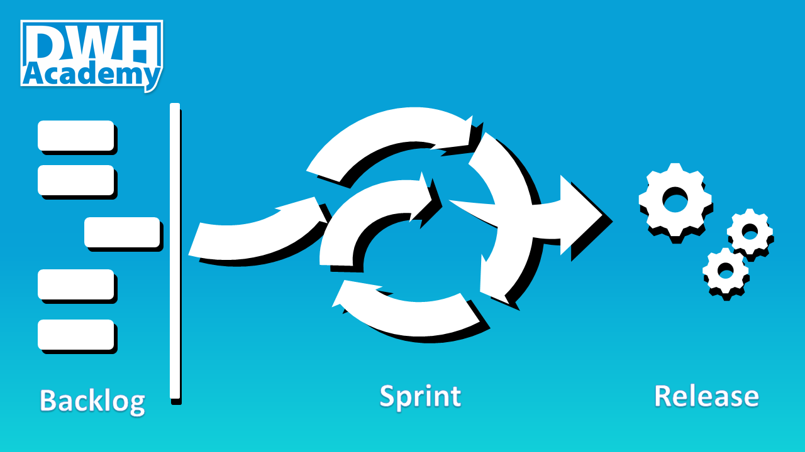

Working in Agile became a hot topic. Big consulting companies (including big 4) realized that implementing agile methodology is a very lucrative business. But have you ever seen a good implementation of Agile methodology in Data Warehousing? Probably not, otherwise you would not bother to read this article. Agile methodology in DWH requires a very special approach.

We plan to post a set of articles to describe our experience and practical tips on how to approach Agile in DWH, but let’s start with basic hints.

### The core principles of Agile
I should probably start with the definition of the Agile methodology but there are hundreds of such articles already written, so if the term 'Agile' is new to you, I suggest to read the article here: https://zenkit.com/en/blog/agile-methodology-an-overview/. Instead, I would prefer to focus on principles that are crucial for Data Warehousing.

Agile stands on three pillars. Continuous iterative, incremental development. Full transparency of current progress at any point in time. Cross-functional team members. 

In Agile the software project delivery is broken into small pieces, each delivered in a short period of time (weeks). Instead of building a big house in several years, we build each room step by step to let your customer move there one by one. Releasing the product in smaller parts gives the customer the opportunity to revise the requirements before it is too late.

Full transparency of the project development at any point of time is in the long term the only way how, to be honest about the team’s progress. It also gives both customer and the implementation team the chance to catch any deviation from the desired direction and to recognize when the progress is slowing down.

The advantage of cross-functional team players is not that one can play more different roles at the same time,  but that one can switch between the distinct roles to function as a developer, data modeler or analyst. Just one role at one time but as choice from many, based on the actual project needs. This ability brings extra scalability to the team,  and for the team member, such experience enforce the skills in each of the roles by putting things into context. 

### Scrum as the main Agile framework
Scrum is an Agile framework that is used to implement the ideas behind Agile software development. Its goal is to develop, deliver, and sustain complex products through collaboration, accountability, and iterative progress.

We can identify 3 different roles in each Scrum team: 
- Product owner: the voice of the customer. 
- Development team: a group of professionals who deliver the product. 
- Scrum master: he helps the team to work together.

The development team can consist of different professionals depends on a project type, the teams working in DWH should ideally have: business analysts, designers, developers, and testers.

### Conclusion
This article meant to just introduce you to Agile as a methodology. We could write a book on this topic but we prefer to focus on different aspects of working in Agile in DWH environment which is, we think, is very special and requires a dedicated approach. In the next articles, we want to show how to create Agile development environment using available software tools, how the team should work together and what are the common traps you should avoid when implementing Scrum framework in your organization.