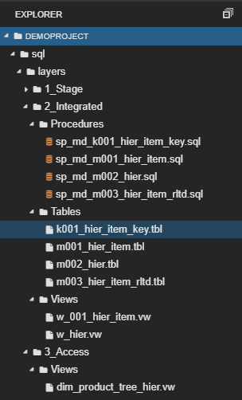

This article is the second part of the series of how to cope with hierarchies in 3NF models ([Hierarchies in 3NF model](https://posts.dwhacademy.com/hierarchies/)). If you have not read the previous one yet, I strongly encourage you to read it because from time to time in this article I will be referring to the previous article in the series. 

Today I will show you how to connect underlying products with their hierarchy. The hierarchy as a standalone set of data cannot serve many purposes if we do not connect it to the underlying object it relates to, for instance, the hierarchy of region would be meaningless if we would not combine countries (if that is the granularity of data in our case) with each continent or geographical region (EMEA, APAC, etc.). So the hierarchy can be fully functional if it combines all its nodes with the underlying objects it relates to.  

After reading this article <b>you will learn</b>:

- how to build a universal model to store the hierarchy with their underlying objects

- how to generate surrogate keys

After reading this article <b>you will not learn</b>:

- how to historize target tables (topic for another long article)

### Source file
In the source file, we have the list of products with its attributes, such are the name of a product, model year, list price, node_id (that will act as a bridge to our hierarchy) and brand_id.

In a source system (ERP) the table is named as 'products' and for education purposes, we will keep the same in our stage layer (demo_sl). Every product has a node_id which represents a node in the product hierarchy table, also available in the source (the table was presented in details in the previous article).

### Create your model
It is the time to extend our current ER model with the 3 additional entities - we need a key table for storing the underlying products, an entity to store product attributes (main table) and another relationship table to define the relationship between each product and the lowest hierarchy item in the given node.

Feel free to copy the model, just clone my project: [Demo_il model in genmymodel.com](https://repository.genmymodel.com/g.swierniak.hcs/DWH-Academy)

Let me quickly give you an overview of the tables that we have:

- <b>k004_prod_key</b> - key table to uniquely define each product - the table where we store natural keys

- <b>m004_prod</b> - main target table for products

- <b>m005_hier_item_prod_rltd</b> - the relation table that stores relationships between hierarchy items (lowest level) and products

<table>
   <tr>
      <td>
        <b>Important note</b>
         In order to keep the article clear enough, some scripts were shortened, normally the pattern is presented in the first 2 and the last UNION and the rest of UNIONs were cut off.
         But all functional scripts can be found in the GitHub repository,
         so feel free to download them and test if on your own. Link to the the dwhacademy/demoproject repository can be found at the end of the article.
      </td>
      <td>
         
      </td>
   </tr>
</table>

### Design the transformation logic

<b>The transformation logic</b>

The transformation logic is wrapped in a view that will be used to update key table (k004_prod_key) and the main target table (m004_prod), therefore in the view, we should combine all columns from both tables. Fortunately, the logic to uniquely define each product is simple in our case because the product_id in the source is unique and it is the perfect candidate to act as a natural key.  Here are a few key facts about the logic:

- number of unions is equivalent to the number of levels in the hierarchy,

- brand_id and node_id as connection points to hierarchies are excluded from the main targettable for products (m004_prod),

- product_id was mapped to the column called prod_cd because "id" suffixes are reserved for surrogate keys

### Load your model
<b>Generate surrogate keys</b>

It is time to start loading our tables in the integrated layer. At first, we have to make sure, all our products have their own surrogate keys, in order to do that - we update the key table at the beginning. In the script below you can find the common formula for surrogate key generation:

- <b>row_number() over(order by hier_item_src_key) + coalesce(max(hier_item_id),1000000)</b>

<b>Load target table</b>

Having all surrogate keys in place, we can easily insert data to our main target table - m004_prod. 

<b>Results</b>:

<b>Load relationship table</b>

In order to finally connect products with the lowest levels of hierarchy items, we need to define logic to load m004_hier_item_prod_rltd. It requires combining products and products_tree_unq tables from the source and then joining our key tables from our Integrated Layer to get the surrogate keys for each of the object (hier_item_id and prod_id).

### Views on the top of the Integrated Layer tables

<b>Recursive view as a universal object to store all hierarchies</b>

Once the tables in our integrated model had been loaded, we can modify the recursive view we created in the previous article. Just to remind, the recursive view aims to prepare data for denormalization in the Access Layer through combining each underlying object (product or hierarchy item) with its all upstream levels of hierarchy. The recursive view contains two unions: in the first union, we need to define the lowest level of the hierarchy (product level in our case) together with its direct parent hierarchy item. In the second union, we build all the upstream levels up to the top.

<b>Hierarchy - final obejct for Access Layer</b>

The second and the last step in denormalization exercise is to pivot the data from the recursive view. I named the new view as dim_product_tree_hier and placed it in the Access layer (demo_al) because it is the proper layer to create such denormalize tables(views). The modification I applied here is that I added prod_id and prod_nm to the pivoting PK, so now we can see all products and what hierarchy node they fall under.

### Summary

I hope that you found this article interesting, in the next article I will try to show you how to add the second hierarchy for products, so each product can be seen in the context of 2 dimensions (we will use Grafana tool to visualize this).

All the scripts presented in this article can be found also on [GitHub](https://github.com/dwhacademy/demoproject.git), feel free to use them and try to improve!
