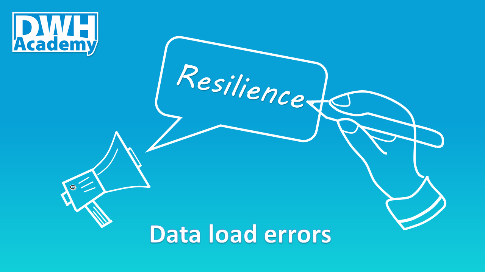

There are two main goals for dealing with data load errors. The first one is to minimize the impact of errors on the current usage of existing data in our data warehouse. The second is to speed up the analysis of error so it can be quickly fixed and the complete data load successfully finished. 



### Problem isolation
Let's start with the first one. It is a good practice to isolate the problem so it is not impacting anything that is not directly related to it. It means that the error of one job doesn't stop the whole data flow.  So other data areas can be successfully loaded. 

#### Incremental load in Integrated layer
The question is how to deal with the data directly impacted by the data load error.  The answer is "It depends". The integrated layer usually contains a history and is loaded incrementally. In case of load failure we can still use the data, only the last increment is missing. To make this approach rock solid, the load jobs need to be defined as a transition, so in case of failure, the whole job for one particular entity is rolled back without inserting any incomplete data to the target database.

#### Data persistance - Two full snapshots of data in Access layer, the prior and latest load
There is a different scenario in the access layer or data marts that are not loaded incrementally but as a full snapshot. In such a case, we would lose the only data we have within the load error.  The possible solution is to keep two snapshots of data in each table, each distinguished by the load_id. 

This approach not only fixes the problem with losing the data, but it also provides additional benefits. We can provide data in the access layer during the whole load without any interruption. And we can even roll back to the prior snapshot if we later realize some problems in data. 

### Error analysis support
Now it is time to talk about the second goal. To speed up the analysis of error, we need the best possible description of the error, easily available for the analysts. The best approach is to improve the load status logging, extending it with error details and position of the last executed step in the data flow.

Now let's dive into the implementation

#### The logging table structure
<script src="https://gist.github.com/lubomirkamensky/31571bab82bd12b7c95fdb8f4da0236e.js"></script>

#### Exception handling in all procedures
There are different approaches based on the platform you use. We stay with Postgresql which is the database platform of our [demo project](https://github.com/dwhacademy/demoproject/tree/issue-12-implement_load_error_resistance). This is the way how to catch any kind of error in the procedure, generate the Status and collect error status details: 

```
EXCEPTION WHEN OTHERS THEN
    STATUS := 'Failure';
    V_SQLERRM := SQLERRM;
    V_SQLSTATE := SQLSTATE;
```
example of one procedure, see the line 46:
<script src="https://gist.github.com/lubomirkamensky/6150ba77c31ba3855353830f3ada7fb6.js"></script>

#### Load driving procedure
All procedures will be called from one procedure driving the whole load of one particular data layer. Each called procedure has 5 parameters:

- V_Load_ID - inputs load_id
- Status - returns back the status of the procedure call
- Step - returns back the last  executed step of the procedure call
- SQL_Error - returns back the SQL error in case of failure of the procedure call 
- SQL_State - returns back the SQL state in case of failure of the procedure call

Load driving procedure for Access layer:
<script src="https://gist.github.com/lubomirkamensky/a4cde929abb5642bac2a36e35a7a9e16.js"></script>

##### Loging the output of procedure calls
All vaiables returned back from each called procedure are logged into table [load_stat](https://github.com/dwhacademy/demoproject/blob/issue-12-implement_load_error_resistance/sql/1_layers/4_meta/tables/load_stat.tbl).

#### Data persistance
We added Load_Id into all tables of AL. Example here:
<script src="https://gist.github.com/lubomirkamensky/e944813aeee577d6de129daceeee094c.js"></script>

There is view defined on top of each table to show just the latest snapshot of data. Example here:
<script src="https://gist.github.com/lubomirkamensky/880eaf2697f77a40afbc0c6e7cc00f75.js"></script>

We updated the delete statement for the tables so within each load  we keep a maximum of two full snapshots.
See the line 9 of the procedure dev_demo_al.sp_dim_customer above.