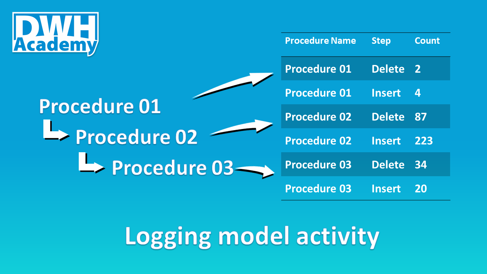

Data is constantly changing for various reasons. Sometimes it is a result of errors made but human, sometimes the changes truly represent changes in the real-world, so none of the data warehouses can work without proper historization. This article will introduce you to a very fundamental type of history handling - technical history.

### Technical and business history

	
tbd

### Common pattern to historize target tables

Fully functional code is available in our [Demo Project Repository on GitHub](https://github.com/dwhacademy/demoproject/tree/issue-6-implement_logging).

