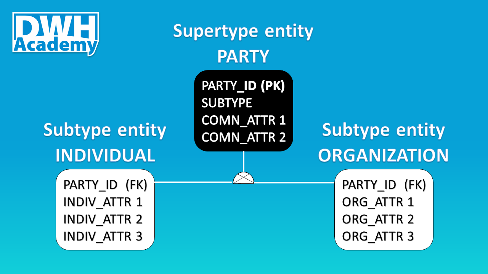
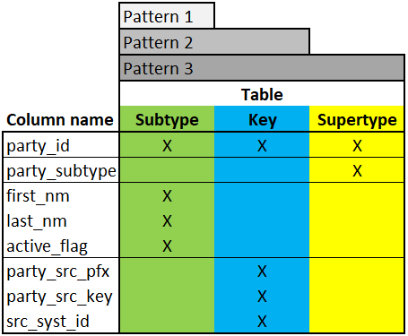

Subtyping is a very powerful tool used in the relational models. In this article, I would like to show you why this technique is widely used in many data warehouses and how to implement it in your project, based on the party entity, probably the most common example. 

### Definition
Let begin with the definition - subtyping is a technique where an entity is broken into Supertype entity with common (shared) attributes, and also 2 or more Subtype entities that contain attributes that are unique for those 2 or more entities. In fact, from my experience, Subtype entities are created first as regular entities in the logical model and after some time, it can be noticed that the entities can be abstracted to one group and as a result, a new Supertype entity is created. For example, we might create 2 entities 'Individual' and 'Organization', both can be abstracted to one group called 'Party'.

### Why Subtyping?
There are a number of reasons why this technique is very useful. For me, the most important motivation is that relationships can be accurately modeled and enforced including those which apply to only one Subtype. Moreover, the number of relationships is significantly reduced because they can be built on the Supertype entity level and not every individual Subtype entity, it makes the model much simpler.

The cost associated with Subtyping you need to take into account is abstraction. It is hard for some people to grasp. Typical abstract entities are: Party, Location, Event.

On the picture below you can see 4 relationship tables (yellow headers), each of them is linked with m006_party table, if the subtyping technique would not be used, we would need to multiple number of relationships by 2, because each relationship table would need to be linked with both: m008_indiv and m009_org tables.

Feel free to copy the full model, just clone my project: [Demo_il model in genmymodel.com](https://repository.genmymodel.com/contact.dwhacademy/DWH-Academy)

### Discriminator
Before we jump to the implementation, it is worth mentioning, Subtype entities can be mutually exclusive or mutually inclusive. The example, I prepared, is based on the first pattern where entities are mutually exclusive. There cannot be a Party that belongs to both groups, it is obvious that an individual cannot be an organization and vice versa. This logical requirement should be satisfied through the Discriminator - a column normally called 'Subtype' that specifies to which Subtype entity a given object (Party) belongs to.

### Implementation
I do not intend to explain from scratch the way, how we believe it makes the most sense to maintain business logic in data warehouses but I feel a short recap from other articles is necessary.

All business logics we keep in views, stored procedures are vehicles to move data from views to target tables. Structure of that views depends on type of target tables we build business logic for:

<b>Pattern 1 - Relationship tables</b>:

- Columns from Target table

<b>Pattern 2 - Target tables with Key tables</b>:

- Columns from Target table

- Columns from Key table

<b>Pattern 3 - Subtype tables with Key tables</b>:

- Columns from Supertype table

- Columns from Subtype table

- Columns from Key table

<b>No Pattern - Supertype tables with Key tables</b>:

- no views - business logic is kept at the Subtype level

### Views
It is obvious that for our example we will use Pattern 3. We create 2 views, one for each Subtype table (w_008_indiv & w_009_org). The views designed in that pattern will be used to:

- generate surrogate keys for the Key table at the Supertype level (k006_party_key)

- update the Supertype table

- update the Subtype table

When designing the views, you need to decide on the Natural Kay and what will be the Discriminator. In my first view, I used first_name||'#'||last_name as NK and 'Individual' as party_subtype that assigns those rows in the Supertype table to one group/table: m008_indiv.

### Stored Procedures
As noted earlier, stored procedures are simple vehicles to move data from views to target tables. We will be inserting data to target tables, as a source we are using the same views. We have to follow the top down approach, starting with Supertype entities (Key and Target tables) and then move to Subtype entities.

We cannot update the Supertype Target table (m006_party) if we are not sure that all individuals and organizations have surrogate keys, therefore we insert records to the Key table first (<b>k006_party_key</b>) and generate surrogate keys for all objects that do not have them yet. What is important here, we need to perform 2 insert statements, each one for each view.

The second procedure we can create (and execute) is the procedure that updates the Supertype table (<b>m006_party</b>). In my example, apart from party_id we have only one attribute which is in fact the Discriminator, but in practice, we will find other attributes that are common for all Subtype entities. If I would simplify my model, the attribute such is 'Address' could be added to the Supertype entity as 'shared' property.

The final step is to update Subtype tables with attributes that are unique to each of those groups - <b>m008_indiv</b>:

.. and <b>m009_org</b>:

### Summary
I hope that you found this article useful. I encourage you to use this technique in your data warehouse since it is very powerful and easy to implement technique. If you have any experience with Subtyping, feel free to share this with us.

Fully functional code is available in our [Demo Project Repository on GitHub](https://github.com/dwhacademy/demoproject/tree/POST-Subtyping).

