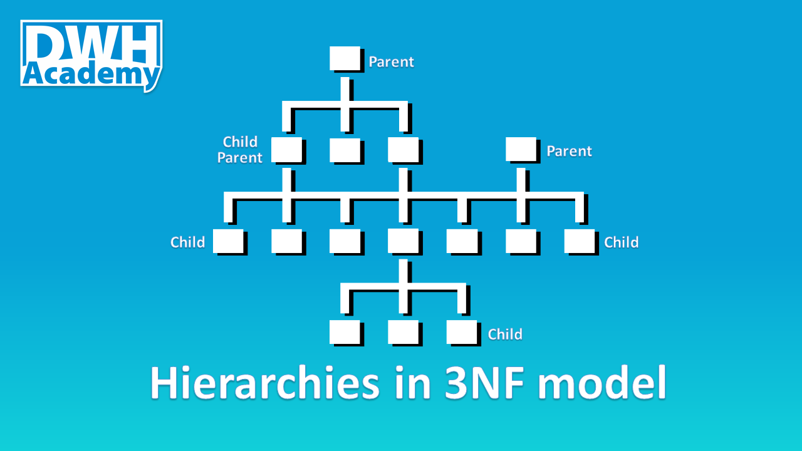

In today's article, I want to show you how to store n- number of hierarchies with n- number of levels using just 4 tables. The 4 tables will represent 3rd normal form (3NF) of our new integrated model. The scripts below you can apply in your own model and see how powerful this technique is, I've been using it for some time and the actual implementation does not vary that much whatever hierarchy you have, trust me!

After reading this article <b>you will learn</b>:

- how to build a universal model to store hierarchies

- how to generate surrogate keys

- how to normalize data

After reading this article <b>you will not learn</b>:

- how to historize target tables (topic for another long article)

<table>
   <tr>
      <td>
         In order to keep the article clear enough, some scripts were shortened, normally the pattern is presented in the first 2 and the last UNION and the rest of UNIONs were cut off. 
         But all functional scripts can be found in the GitHub repository, 
         so feel free to download them and test if on your own. Link to the the dwhacademy/demoporject repository can be found at the end of the article.
      </td>
      <td>
         
      </td>
   </tr>
</table>

### Source file
Let's start with the source file - the hierarchy that we are going to normalize and store in our data warehouse. The hierarchy represents the group of products in a sports store with up to 9 levels, up to 9 levels means that some group of products can have fewer levels, like 'Balls' - only 4 levels.

In a source system (ERP) the table is named as 'product_tree_unq' and for education purposes, we will keep the same in our stage layer (demo_sl). Additionally, every node in the hierarchy has its own unique identifier called 'node_id', which is used to specify what products fall under a given node (we will come back to that field in the next article).

### Create your model
It is the time to design the model in 3rd normal form - the model you see below can fit any hierarchy with any number of levels, so next time you will be moving a hierarchy to your data warehouse, take the model as is, don't waste your time trying to reinvent the wheel.

Feel free to copy the model, just clone my project: [Demo_il model in genmymodel.com](https://repository.genmymodel.com/g.swierniak.hcs/DWH-Academy)

Let me quickly give you an overview of the tables that we have:

- <b>k001_hier_item_key</b> - key table to uniquely define each hierarchy item (node) - the table where we store natural keys

- <b>m001_hier_item</b> - main target table for hierarchy items (nodes)

- <b>m002_hier</b> - the reference data - specify different hierarchy types

- <b>m003_hier_item_rltd</b> - the relation table that stores parent-child relationships between hierarchy items (nodes)

### Design the transformation logic

<b>Load reference data</b>

Before we actually get to designing the transformation logic for our target tables, we need to load our reference data - in our case, we have only one hierarchy, so we just need to insert one record with hierarchy name into m002_hier table. I named our hierarchy as 'Product_Group', in fact, it can by any other name you wish but please make sure it has a proper business meaning.

<b>The transformation logic</b>

The transformation logic is wrapped in a view that will be used to update key table (k001_hier_item_key) and the main target table (m001_hier_item), therefore in the view, we should combine all columns from both tables. Here are a few key facts about the logic:

- number of unions is equivalent to the number of levels in the hierarchy,

- the natural key for hier_item is a concatenation of a node from given level and all its all upstream nodes,

- we have to 'left join' the key table, in case a given node does not exist  in the key table then a new surrogate key will be generated,

- the join to m002_hier table is mandatory, it specifies what hierarchy we are normalizing.

### Load your model
<b>Generate surrogate keys</b>

It is time to start loading our tables in the integrated layer. At first, we have to make sure, all our hierarchy items (nodes) have their own surrogate keys, in order to do that - we update the key table at the beginning. In the script below you can find the common formula for surrogate key generation:

- <b>row_number() over(order by hier_item_src_key) + coalesce(max(hier_item_id),1000000)</b>

I encourage you to use this formula because it gives you full control over the surrogate key generation and can be built in most RDMS I am aware of (Teradata, PostgreSQL, Oracle, etc.).

<b>Load target table</b>

Having all surrogate keys in place, we can easily insert data to our main target table - m001_hier_item. As I pointed out, this article is not meant to teach you how to properly historize tables in the integrated model, therefore to keep the simplicity of this lesson, I use SCD type 1 in my procedures, meaning I delete the target table completely before inserting new records.

<b>Results</b>:

<b>Load relationship table</b>

Another crucial table to load is m003_hier_item_rltd which defines parent node and child node relationship - as a general rule, each parent can have multiple children and each child can have only one parent. Simple joins to the key table should easily specify the relations between nodes.

### Views on the top of the Integrated Layer tables

<b>Recursive view as a universal object to store all hierarchies</b>

Once the tables in our integrated model had been loaded, we have fully normalized hierarchy. Of course, the data can't be easily accessed yet, therefore we should aim to denormalize the data and put it in the nice hierarchical form. The first step to achieve that is to create a recursive view that will associate parent-child relationships with level of hierarchies they belong to.

<b>Hierarchy - final obejct for Access Layer</b>

The second and the last step in denormalization exercise is to pivot the data from the recursive view. I named the new view as dim_product_tree_hier and placed it in the Access layer (demo_al) because it is the proper layer to create such denormalize tables(views). The view is designed in such a way that surrogate keys are placed next to the original node names, so every node (hier_item) can be joined a specific product.

### Summary

I hope that you found this article interesting, in the next article I will try to show you how to associate individual products with the hierarchy that we have built.

All the scripts presented in this article can be found also on [GitHub](https://github.com/dwhacademy/demoproject.git), feel free to use them and try to improve!
