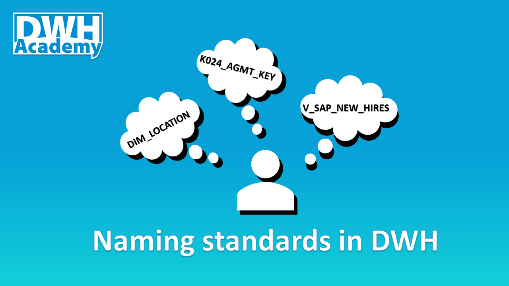

The main goal of adopting a naming convention for database objects is so that you and others can easily identify the type and purpose of all objects contained in the database. In this article, I want to describe one of the possible ways of adopting naming standards, undoubtedly there are other standards that also work but my goal is to show you the ones I applied and they proved to be working very well. I do not believe the same naming standards can be applied to all layers of the DWH (read more about Proven DWH Design <a href='https://posts.dwhacademy.com/proven-design/' target='_blank'>here</a>). Each layer serves a different purpose, so different users will be accessing them - let’s use the standards that fit their needs. Despite that, there are certain aspects of naming conventions that are common for all objects, no matter where in the architecture of the DHW they reside.

### Common standards
- Table and view names should always be in a singular form (PARTY instead of PARTIES). 
- Multiple words in the object name separate with an underscore (“_”), for instance, HIER_TYPE but try to avoid all other special characters, such are: '$', '&', '#', '@', etc.
- The next common rule refers to capital letters - use them consistently across all object names in your database (views, tables, columns, procedures, etc.).
- Prefixes are a very powerful technique to organize your list of tables, views or procedures, especially when you deal with mid- and large scale Data Warehouses.

### Staging layer naming standards
The names here are straightforward since this layer consists of only tables (views) that represent raw data from source systems. The general pattern is to use a prefix with the source system name (can be abbreviated) plus the business meaning of data in that table, as follow:

- <b>Source system prefix + Business name </b>(for instance: SAP_NEW_HIRES)

Very often you can hear about the restriction where data from the staging layer cannot be accessed directly (from tables), but only through views that are built on top of that tables (restricted access might be applied on views). In such a case, we just need to add another prefix 'V_' in front of the source table:

- <b>V + Source system prefix + Business name </b>(for instance: V_SAP_NEW_HIRES)

### Integrated layer naming standards
Some of the rules you will find below might not adhere to general naming conventions you know from books. But I want to highlight the fact that the primary goal of the Integrated layer is to be easily extensible, scalable and allowing to track the history of changes in data. Therefore it requires lots of objects that should support those objectives that need to be very well organized.  

Although I am not a huge fan of abbreviations, I need to admit that they are really necessary. Of course, you can start building your integrated layer using full names, but as the complexity of your DWH grows, sooner or later you will realize that you need to start using them. Thus I suggest starting to abbreviate the name of your objects from day 1. 

Another unpopular rule I would like to share is the table numbers. Each table that is part of your model in the Integrated layer should contain an internal number, that should be used as a prefix in the object names. The numbers can also act as some kind of name aliases to simplify the reference to particular tables, as the full name may be long and complex. Just to remind you, here we are discussing the Integrated layer, the core of the data warehousing, the model that very often has hundreds of tables, so not to organize them through numbers seems to be very reckless.

Now let's go through different prefixes for tables and views you might use in your Integrated layer. The general pattern is:
Prefix + Table number + Business name
Prefixes for tables:

- <b>K</b> - (k)ey table - tables that store natural key definitions and surrogate keys, for example, K015_PARTY_KEY.
- <b>M</b> - (m)ain target table - tables that contain full history, for example, M015_PARTY.
- <b>T</b> - (t)emporary table - 1:1 table with 'M' table used for history handling, for example, T015_PARTY.
- <b>X</b> - configuration/metadata table -  tables that are maintained by business or development team and can configure how the final reports look like.

Prefixes for views:

- <b>V</b> - filters only active records from main (M) table, for example, V015_PARTY.
- <b>A</b> - (a)ccess view - views built on top of 'V' views (active records) but additional logic to prioritize certain data sources (when there is an overlap) is applied, for example, A015_PARTY. These views represent final data that should be propagated to Access layer.
- <b>W</b> - (w)orking view - views with business logic - the place where all transformations should be put in place, for example, W_015_PARTY_SAP - this view contains business logic from SAP source system that should be integrated into the M015_PARTY table.

### Access and Datamart layer naming standards 
Unlike the Integrated layer, in Access layer we should avoid abbreviations because it is the layer where business users may access directly. The only acceptable abbreviation is DIM, stands for dimension. This abbreviation can be used together with FACT as the only common prefixes used here:

- <b>DIM</b>, for example, DIM_LACATION.
- <b>FACT</b>, for example, FACT_SALES.

All access layers have to be built as star schema, so there is no need for any other prefixes. Sometimes, when you have multiple star schema models in your access layer, I suggest adding given subject area name after the DIM/FACT prefix to logically organize objects from the same area, for example, DIM_HR_REGION

