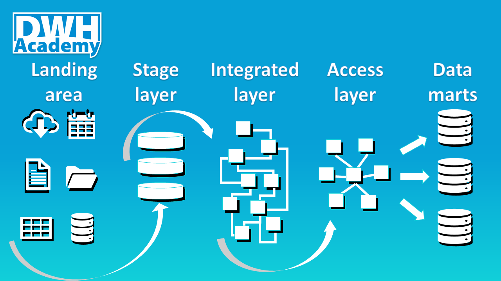

There is an unlimited number of ways how to build a data warehouse. Few of them work and some of the few can even survive in the long term. In this post, we are going to describe the high-level design of the typical successful DWH in the long term.

### Landing Area
Imagine the Landing Area as an address, where the files from the source systems arrive. It is the first interface of the DWH, usually some file system organized into directories for each source file. The main goal of the Landing Area is to organize separate source files into batches which can be loaded into a database.

The challenge of the Landing Area is the control over the source files which are usually delivered by external parties. It needs to be recognized when some part of data is missing or when the structure of the data is not satisfying the delivery agreement with the source system. The biggest challenge is to completely automate all that. Frequently, a lot of manual inputs is involved here, and this, in theory, the simplest part of the DWH becomes the real bottleneck.

### Stage Layer
The Stage Layer is the first database layer, where the data from the source files are loaded.  The structure of the data stays the same as the structure of the files, just a few technical columns are added like load timestamp and load identifier.  The goal of the Stage layer is to create a snapshot of the source files from the Landing Area, which is easily accessible by other database layers.  

For further processing, it is necessary to know what kind of source files we have.  There are two main types of source file delivery.  The first one is full snapshot data, the second is incremental data. We are not going to dive into details here, but it is good practice to store the information about the type of source data delivery as another technical column in the Stage layer tables.

### Integrated Layer
The Integrated Layer is the topic for a whole book, it is frequently a subject of endless discussions which are often raising a lot of emotions.  I will try to avoid that for now. The Goal of this layer is to Integrate data from multiple sources into one consolidated data model.   The priority is on the optimal data storage and long term maintenance, not on the user-friendly access to the data. The Integrated layer is the core of data warehousing.  It needs to be easily extensible, scalable and allowing to track the history of changes in data.  It is the only layer, where the full history of data in the full detail is available. 

The data model of Integrated layer is a normalized relational model in third normal form.  A good practice is to use some level of abstraction creating common entities which can be used to store a wide range of data.  A useful pattern is subtyping. That's a good topic for another article but now I want to make a few other notes.  To be able to store data in the Integrated layer you need a very good understanding of your data. If that is not the case, then there is no way how to load them into an Integrated layer and not to make it just useless expensive garbage.

The integrated layer is always expensive, the costs pay back when you share the stored data across multiple projects when the long history of data is required or when massive data consolidation is needed or when the volume of data to process is growing.  But it a big luxury to build it for one report and it is complete nonsense to load it with data you don't understand yet.  Let's talk about such scenario later in the section Data marts. 

### Access Layer  
While the Integrated layer is optimized for data storage, the access layer is optimized for data access. Simple, user-friendly, fast, those are the priorities. Everything there is driven by the user experience of Access layer usage. The ultimate goal is to satisfy the need of the business users. The usual approach is building a dimensional data model, a star schema where the main fact tables are surrounded by a few wide dimensions. The motivation behind the grouping of properties into just a few dimensions is to simplify the usage and improve the performance.

The Access layer is built on top of the Integrated layer. It is the first, basic, business-friendly interface into the Data warehouse.  The challenge is to make business users accept Access layer as their Semantic layer where complex data is mapped into well-defined business terms. Usually, the biggest challenge is already the first step, to create the dictionary of business terms and definitions which can be transformed into the data mappings and finally implemented as Semantic layer.

### Data marts
Data marts are usually called independent, they can source data from any other layer and even manual inputs of data are acceptable.  Data marts are a perfect tool for prototyping. As I already mentioned when talking about the Integrated layer, there are scenarios when we have data which we don't fully understand. We have some assumptions and theories but to prove them, we need to run a series of experiments. Integrated layer is too expensive for such experiments, we need some data labs.  Of course, Data lab is just one of many roles which Data mart can play.  Data marts can be built also on top of the Integrated or even Access layer.

Anytime the expected output of some BI project is too specific, experimental or just unpredictable to be shared across the enterprise, then it is the time to consider Datamart as an option.  In fact, there are no strict rules how to build data marts.  Their goal is to find a minimalistic, pragmatic way how to deliver the results.

